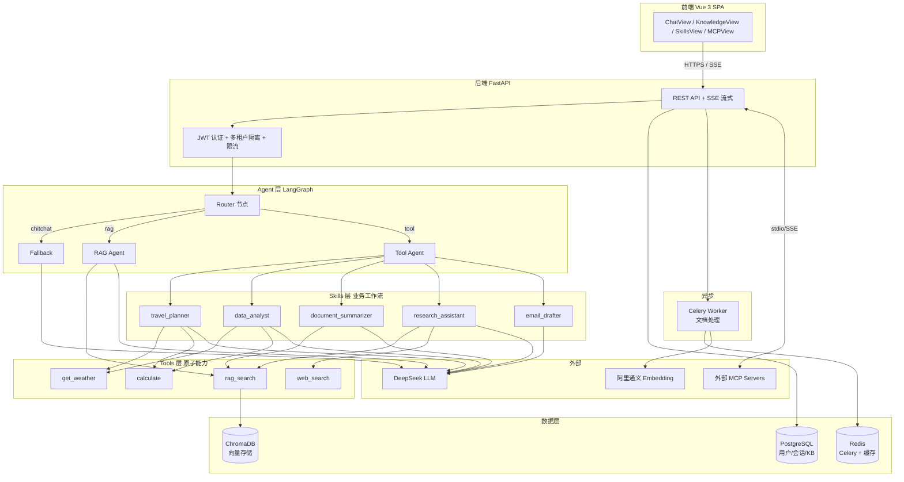

<div align="center">

# 🧠 NexusAI

**LangGraph 多 Agent · RAG · MCP 协议 · 企业级 AI 中台**

把私有知识、多步推理、外部工具、MCP 协议串成一个 **可观测、可控、可扩展** 的 AI 平台

<!-- 状态徽章（Live Demo / CI / Coverage 上线后替换占位 URL）-->
[](#-live-demo--功能截图)
[](#)
[](#)
[](LICENSE)

[](https://www.python.org/)
[](https://fastapi.tiangolo.com/)
[](https://vuejs.org/)
[](https://github.com/langchain-ai/langgraph)
[](https://www.trychroma.com/)

🎬 **[在线体验 →](#-live-demo--功能截图)** &nbsp;·&nbsp; 🏗️ **[系统架构 →](#️-系统架构)** &nbsp;·&nbsp; 🚀 **[5 秒启动 →](#-一键启动推荐)**

---

🏆 **30+ REST API · 5 Skills · 4 Tools · 3 种分块策略 · MCP 双向集成 · ~9,500 行代码 · 全 Docker 部署**

</div>

---

## ✨ 核心特性

<table>
<tr>
  <td width="50%">

### 🤖 多 Agent 智能协作
基于 **LangGraph** 状态机的可控编排：
- **Router** 节点智能识别意图（chitchat / rag / tool）
- **RAG Agent** 处理私有知识问答
- **Tool Agent** 通过 Function Calling 调外部能力
- **Fallback** 兜底，闲聊 + 错误恢复
- 每一步执行链路 **全程可观测**

  </td>
  <td width="50%">

### 📚 完整 RAG 管道
从文档到回答的全流程：
- **3 种分块策略**：Recursive / Markdown / **Semantic**（基于 Embedding 跳变）
- **阿里通义 Embedding** + **ChromaDB** 向量检索
- **multi-query RAG**（拆解查询提升召回）
- **引用标注** 避免幻觉

  </td>
</tr>
<tr>
  <td>

### 🎯 5 种 Skills 编排
**Skill = Tool + Prompt + LLM 链式调用**

| Skill | 形态 |
|------|------|
| `travel_planner` | 1 Tool + 1 LLM |
| `data_analyst` | LLM-Tool-LLM 三明治 |
| `email_drafter` | 纯 LLM 多步推理 |
| `document_summarizer` | multi-query RAG |
| `research_assistant` | web + RAG 多源综合 |

  </td>
  <td>

### 🔌 MCP 双向集成
**完整的** Model Context Protocol 实现：
- **作为 Server** 把 RAG + Tools 暴露给 Claude Desktop 等外部 client
- **作为 Client** 动态接入外部 MCP Server（GitHub、Filesystem...）
- 前端可视化配置 + 一键测试连接

  </td>
</tr>
</table>

---

## 🏗️ 系统架构



---

## 🎬 Live Demo & 功能截图

> **在线体验**：即将部署到 Railway · [点这里访问](#)（部署完成后替换链接）
>
> **演示账号**：`demo` / `demo123` （已预填示例知识库，无需上传文档即可体验）

| 智能对话（SSE 流式 + 思考过程） | Skills 测试执行 |
|:---:|:---:|
|  |  |

| 知识库管理 + 分块策略 | 暗色模式 |
|:---:|:---:|
|  |  |

> 截图请放在仓库根的 `assets/screenshots/` 目录下（该目录会推送到 GitHub）。

---

## 🚀 一键启动（推荐）

只需 **Docker** 和 **2 个 API key**：

### 1. 准备凭证

```bash
cp .env.example .env
# 编辑 .env，填入：
#   DEEPSEEK_API_KEY=sk-...     # https://platform.deepseek.com/
#   DASHSCOPE_API_KEY=sk-...    # https://bailian.console.aliyun.com/
```

### 2. 启动

```bash
docker compose up -d
```

第一次拉镜像 + 构建约 3-5 分钟。完成后：

| 服务 | 地址 |
|------|------|
| 🌐 前端 UI | **http://localhost** |
| 📚 后端 API 文档（Swagger） | http://localhost:8002/docs |
| 🗄️ ChromaDB | http://localhost:8001 |

### 3. 登录

默认管理员账号：

```
用户名: admin
密码:   admin123
```

> 首次启动会自动跑 `alembic upgrade head` 初始化数据库表结构。

---

## 🧩 本地开发模式

如果要修改代码 + HMR 热更新，使用本地开发模式：

### 基础设施（Docker）

```powershell
# 只跑数据服务
docker compose up -d postgres redis chroma
```

### 后端

```powershell
cd backend
python -m venv .venv
.\.venv\Scripts\Activate.ps1
pip install -r requirements.txt

# 配置 .env（同上）
cp ..\.env.example .env

alembic upgrade head
python main.py
```

新开终端跑 Celery：

```powershell
cd backend
.\.venv\Scripts\Activate.ps1
celery -A app.tasks.celery_app worker --loglevel=info --pool=solo
```

### 前端

```powershell
cd frontend
npm install
npm run dev
```

访问 http://localhost:5173

> **快捷启动脚本**：项目根有 `nexus.bat` / `start.bat` / `stop.bat`（Windows）一键控制所有进程。

---

## 🛠️ 技术栈

### 后端
| 类别 | 技术 |
|------|------|
| **Web 框架** | FastAPI 0.115 + Pydantic 2 + Uvicorn |
| **ORM / 迁移** | SQLAlchemy 2.0 + Alembic |
| **数据库** | PostgreSQL 16 |
| **异步任务** | Celery 5.4 + Redis |
| **向量库** | ChromaDB 0.5（HTTP 模式）|
| **Agent 引擎** | LangGraph 0.2 |
| **LLM** | DeepSeek（兼容 OpenAI SDK）|
| **Embedding** | 阿里通义 text-embedding-v3 |
| **MCP** | Anthropic 官方 SDK 1.1 |
| **文档解析** | pypdf + python-docx + langchain-text-splitters |
| **安全** | python-jose（JWT）+ passlib + **slowapi**（限流）|
| **Web 搜索** | duckduckgo-search（免 API key）|

### 前端
| 类别 | 技术 |
|------|------|
| **框架** | Vue 3.5 + TypeScript + Vite 5 |
| **路由 / 状态** | Vue Router 4 + Pinia 2 |
| **样式 / 组件** | TailwindCSS 3 + Lucide Icons |
| **通知** | vue-sonner + 自定义 ConfirmDialog |
| **Markdown** | markdown-it + highlight.js |
| **流式渲染** | fetch + ReadableStream + SSE 解析 |

---

## 📂 主要功能页

| 路由 | 页面 | 功能 |
|------|------|------|
| `/chat` | 💬 智能对话 | SSE 流式 + 思考链路 + 会话重命名/搜索/滚动/重生成 |
| `/knowledge` | 📚 知识库 | KB CRUD + 文档上传/预览/重新处理 + 3 种分块策略 |
| `/skills` | ✨ Skills | **5 个 Skill 详情 + 测试执行**（KB 自动选）|
| `/mcp` | 🔌 MCP 配置 | 外部 MCP Server 增删改 + **测试连接** + 工具清单 |

---

## 🔐 企业化加固

| 维度 | 实现 |
|------|------|
| **认证** | JWT + bcrypt 密码哈希 + 路由级 `get_current_user` 依赖 |
| **多租户** | 所有 KB / Document / MCP / Session 接口按 `created_by` / `user_id` 隔离 |
| **限流** | slowapi 按 JWT-sub 限流：LLM 30/min · 登录 10/min · 上传 20/min |
| **Prompt 防护** | 关键词检测 + 命中时给 system prompt 追加防护指令（非硬阻断）|
| **数据持久化** | 3 个 Docker named volume（postgres / redis / chroma）|
| **健康检查** | Compose 配 `healthcheck` + depends_on condition |
| **错误处理** | 全局异常处理器 + 统一 ApiResponse 结构 |
| **可观测性** | loguru 结构化日志 + 每次对话完整 `execution_trace`（前端可视化）|

---

## 📊 RAG 质量保证（评测体系）

> 即将上线 · 30 条人工标注测试集 + Ragas 量化指标

| 指标 | 含义 | 当前值 |
|------|------|:---:|
| **Faithfulness** | 答案是否忠实于检索资料（不编造）| 待补充 |
| **Answer Relevancy** | 答案是否切题 | 待补充 |
| **Context Precision** | 检索到的资料是否相关 | 待补充 |
| **Context Recall** | 应该检索到的资料是否都召回了 | 待补充 |

评测脚本：`scripts/eval_rag.py`（待加入）· 测试集：`tests/eval_dataset.jsonl`（待加入）

---

## 🧠 Skills 编排示例（明星功能）

`document_summarizer` 的工作流：

```
用户："总结一下这个知识库的核心架构"
       ↓
[LLM 拆解] → ["架构设计", "技术栈", "模块协作"]      (1 次 LLM)
       ↓
[RAG 检索 × 3] → 共 15 chunks，去重保留 10 段        (3 次 Tool)
       ↓
[LLM 综合] → 带 [1][3] 引用的结构化总结              (1 次 LLM)
```

**共 5 次链路调用**，前端 SkillsView 可一键测试，能看到完整 trace。

---

## 🤝 致谢

- [LangGraph](https://github.com/langchain-ai/langgraph) — Agent 状态机框架
- [Anthropic MCP](https://modelcontextprotocol.io/) — 标准化的工具协议
- [DeepSeek](https://platform.deepseek.com/) — 国产推理 LLM
- [ChromaDB](https://www.trychroma.com/) — 嵌入式向量库
- [shadcn-vue](https://www.shadcn-vue.com/) + [Lucide](https://lucide.dev/) — UI 灵感

---

## 📄 License

[MIT](LICENSE) © 2026 NexusAI Contributors
