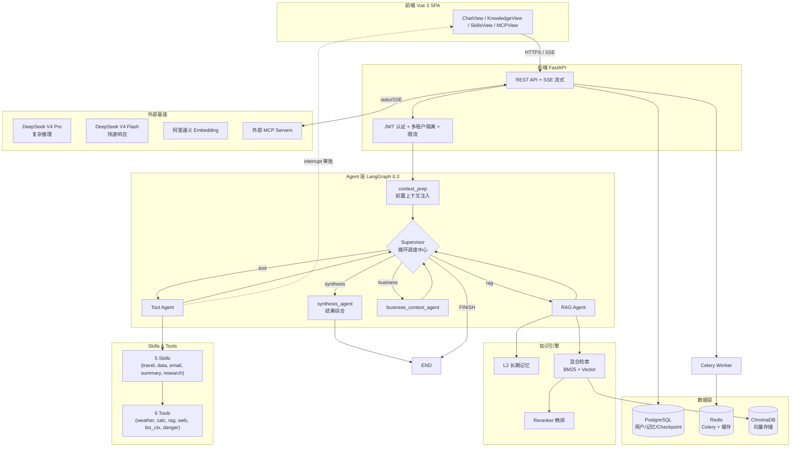

<div align="center">

# 🧠 NexusAI

**LangGraph 多 Agent · RAG · MCP 协议 · 全栈 AI 应用**

把私有知识、多步推理、外部工具、MCP 协议串成一个 **可观测、可控、可扩展** 的全栈 AI 平台

<!-- 状态徽章 -->
[](https://nexus-ai-frontend-production.up.railway.app)
[](LICENSE)

[](https://www.python.org/)
[](https://fastapi.tiangolo.com/)
[](https://vuejs.org/)
[](https://github.com/langchain-ai/langgraph)
[](https://www.trychroma.com/)

🎬 **[在线体验 →](https://nexus-ai-frontend-production.up.railway.app)** &nbsp;·&nbsp; 🏗️ **[系统架构 →](#%EF%B8%8F-系统架构)** &nbsp;·&nbsp; 🚀 **[快速启动 →](#-一键启动推荐)**

---

🏆 **双模型推理 · LangGraph 0.3 循环调度 · 长期记忆 · 混合精排 RAG · HITL 安全审批 · MCP 双向集成**

</div>

---

## ✨ 核心特性

<table>
<tr>
  <td width="50%">

### 🤖 Supervisor 循环调度架构
摒弃单层 Router，采用 **LangGraph 0.3** 的状态循环模式：
- **核心组件**：`context_prep`（上下文注入）、`Supervisor`（主控调度）、多业务节点（`RAG` / `Tool` / `BusinessContext`）、`synthesis_agent`（全局总结）
- **决策循环**：子节点执行完毕后状态自动流转回 Supervisor，由 Supervisor 决策是继续下发任务还是 FINISH
- **快照续跑**：集成 `langgraph-checkpoint-postgres`，支持状态保存与中断恢复

  </td>
  <td width="50%">

### 🧠 L2 动态长期记忆
赋予 Agent 跨会话的上下文感知能力：
- **全局 + KB 专属双维度**：同时检索用户级全局记忆与特定知识库专属记忆
- **动态重要性衰减**：30 天未访问的记忆按引用频次分档衰减 importance（高频引用衰减极慢，零引用衰减快）
- **容量淘汰**：每用户每 KB 上限 50 条，超出按 importance + access_count 末位淘汰；60 天未访问且低价值的自动清除

  </td>
</tr>
<tr>
  <td>

### 📚 多路召回 + 精排 RAG 管线
从文档到回答的完整检索-生成链路：
- **3 种分块策略**：Recursive / Markdown / **Semantic**（基于 Embedding 跳变）
- **1 主 + 2 副多路召回**：BM25 倒排索引 + 双路 Dense 向量扩展
- **Cross-Encoder Reranker 精排**：通义 gte-rerank 模型计算候选块与核心意图的相关度
- **Parent-Child 回溯**：命中子片段自动提取父原文，防止上下文碎裂

  </td>
  <td>

### 🛡️ HITL 与工程决策亮点
- **双模型快慢分离**：复杂推理任务走 `deepseek-v4-pro`，轻量判定/工具调用走 `deepseek-v4-flash`
- **HITL 审批**：外部 MCP 工具或危险操作被 `danger.py` 判定后触发 `interrupt`，阻断图执行，等待前端用户点击授权确认
- **Agent 运行时防伪造**：`AgentRuntimeContext` 在系统底层物理注入用户级 ID，杜绝大模型伪造参数越权

  </td>
</tr>
</table>

---

## 🏗️ 系统架构



---

## 🎬 在线体验

> **地址**：[nexus-ai-frontend-production.up.railway.app](https://nexus-ai-frontend-production.up.railway.app)
>
> **演示账号**：`demo` / `demo123`（已预填示例知识库，无需上传文档即可体验）

---

## 🚀 一键启动（推荐）

只需 **Docker** 和 **2 个 API key**：

### 1. 准备凭证

```bash
cp .env.example .env
# 编辑 .env，填入：
#   DEEPSEEK_API_KEY=sk-...     # https://platform.deepseek.com/
#   DASHSCOPE_API_KEY=sk-...    # https://bailian.console.aliyun.com/
```

### 2. 启动

```bash
docker compose up -d
```

| 服务 | 地址 |
|------|------|
| 🌐 前端 UI | **http://localhost** |
| 📚 后端 API 文档（Swagger） | http://localhost:8002/docs |
| 🗄️ ChromaDB | http://localhost:8001 |

默认管理员账号：`admin` / `admin123`

---

## 🛠️ 技术栈

### 后端
| 类别 | 技术 |
|------|------|
| **Web 框架** | FastAPI 0.115 + Pydantic 2 + Uvicorn |
| **Agent 引擎** | **LangGraph 0.3.34** + **langgraph-checkpoint-postgres**（断点续跑） |
| **双模型基座** | deepseek-v4-pro（推理） + deepseek-v4-flash（快响应） |
| **MCP** | Anthropic 官方 SDK ≥1.2.0 |
| **向量库** | ChromaDB 0.5 + BM25 倒排混合检索（Hybrid Search） |
| **重排模型** | 通义 gte-rerank（Cross-Encoder 精排） |
| **文档解析** | unstructured[pdf,pptx,docx] + pypdf + langchain-text-splitters |
| **Web 搜索** | Tavily（tavily-python） |
| **ORM / 迁移** | SQLAlchemy 2.0 + Alembic + PostgreSQL 16 |
| **异步任务** | Celery 5.4 + Redis |
| **安全机制** | danger.py（HITL 审批）+ AgentRuntimeContext + slowapi 限流 |

### 前端
| 类别 | 技术 |
|------|------|
| **框架** | Vue 3.5 + TypeScript + Vite 5 |
| **路由 / 状态** | Vue Router 4 + Pinia 2 |
| **样式 / 组件** | TailwindCSS 3 + Lucide Icons |
| **流式渲染** | fetch + ReadableStream + SSE 解析 |

---

## 📂 主要功能页

| 路由 | 页面 | 功能 |
|------|------|------|
| `/chat` | 💬 智能对话 | SSE 流式 + 思考链路 + 会话管理 + 重生成 |
| `/knowledge` | 📚 知识库 | KB CRUD + 文档上传/预览/重新处理 + 3 种分块策略 |
| `/memory` | 🧠 记忆管理 | L2 长期记忆 CRUD + 可视化生命周期 |
| `/skills` | ✨ Skills | 5 个 Skill 详情 + 测试执行 |
| `/mcp` | 🔌 MCP 配置 | 外部 MCP Server 增删改 + 测试连接 + 工具清单 |

---

## 📊 质量保证与防幻觉

### 在线防幻觉机制
- **实时忠实度校验**：将 LLM 回答拆解为事实声明（Claims），逐条与检出原文交叉校验支撑度
- **假引用阻断**：引用 `[资料 #N]` 越界时强行剥夺 supported 状态；格式崩塌时回退到余弦阈值兜底标记

### 离线评测
项目内置基准测试脚本 `scripts/eval_benchmark.py`，覆盖：
- 路由准确率（Supervisor 意图分发）
- RAG 质量打分（DeepSeek 裁判模型 0-5 分评估）
- 记忆偏好遵从度（多轮对话中长期记忆的召回效果）

---

## 🤝 致谢

- [LangGraph](https://github.com/langchain-ai/langgraph) — 状态循环引擎
- [Anthropic MCP](https://modelcontextprotocol.io/) — 工具接入标准
- [DeepSeek](https://platform.deepseek.com/) — 国产双模型底座

---

## 📄 License

[MIT](LICENSE) © 2026 NexusAI Contributors
